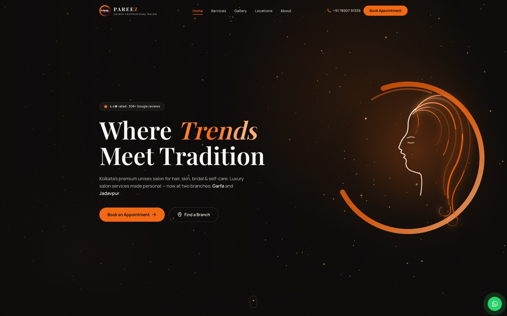

# Pareez Salon — Official Website

> **Live at [pareezsalon.com](https://pareezsalon.com)** · Where Trends Meet Tradition

The official website of **Pareez Unisex Professional Salon**, Kolkata — a premium
unisex salon with branches in **Garfa** and **Jadavpur**. Hair, skin, bridal,
nails and grooming, with online appointment booking.



## Highlights

- 🎨 **Premium dark theme** in the brand's black / orange / white palette
- ✨ **Motion graphics everywhere** — an animated rendition of the Pareez logo
  (a woman's profile drawn in light with flowing hair), a Three.js ember
  particle field, scroll-reveal animations, 3D tilt cards, shimmer text and
  animated counters
- 📍 **Two branch landing pages** with embedded Google Maps and directions
- 📅 **Appointment booking** — structured requests delivered straight to the
  salon's WhatsApp; plus call and walk-in options
- 🖼️ **Showcase gallery** supporting images and silent reel-style autoplay videos
- 🔍 **Deep SEO** — `BeautySalon`/`HairSalon` JSON-LD for both branches (geo,
  hours, 4.4★ aggregate rating), `FAQPage` schema, per-page metadata, Open
  Graph image generated at build time, sitemap, robots, PWA manifest
- ⚡ **100% static output** — every route prerendered for instant loads

## Stack

| | |
|---|---|
| Framework | Next.js 16 (App Router, Turbopack) · React 19 · TypeScript |
| Styling | Tailwind CSS v4 |
| Motion | Framer Motion 12 · Three.js via @react-three/fiber |
| Icons | lucide-react |
| Hosting | Vercel · domain on Cloudflare Registrar |

## Develop

```bash
npm install
npm run dev     # http://localhost:3002
npm run build   # production build (all routes static)
```

## Editing content

Business facts (addresses, phone/WhatsApp, hours, socials, rating) live in
**`src/lib/site.ts`** — one file updates the whole site. The service menu is in
**`src/lib/services.ts`** (no prices are shown anywhere, by design).
Gallery items are defined in `src/components/GallerySection.tsx`; media files
live in `public/gallery/`.

## Pages

`/` home · `/services` · `/gallery` · `/locations` · `/locations/garfa` ·
`/locations/jadavpur` · `/book` · `/about` — plus generated `sitemap.xml`,
`robots.txt`, `manifest.webmanifest` and the Open Graph image.

## Sibling projects

- `pareez-billing` — in-store billing app (Firebase)
- `pareez-billing-admin-dashboard` — owner analytics dashboard

---

© Pareez Unisex Professional Salon, Kolkata ·
[Instagram](https://www.instagram.com/pareezsalon/) ·
[Facebook](https://www.facebook.com/PAREEZ.salon/)
